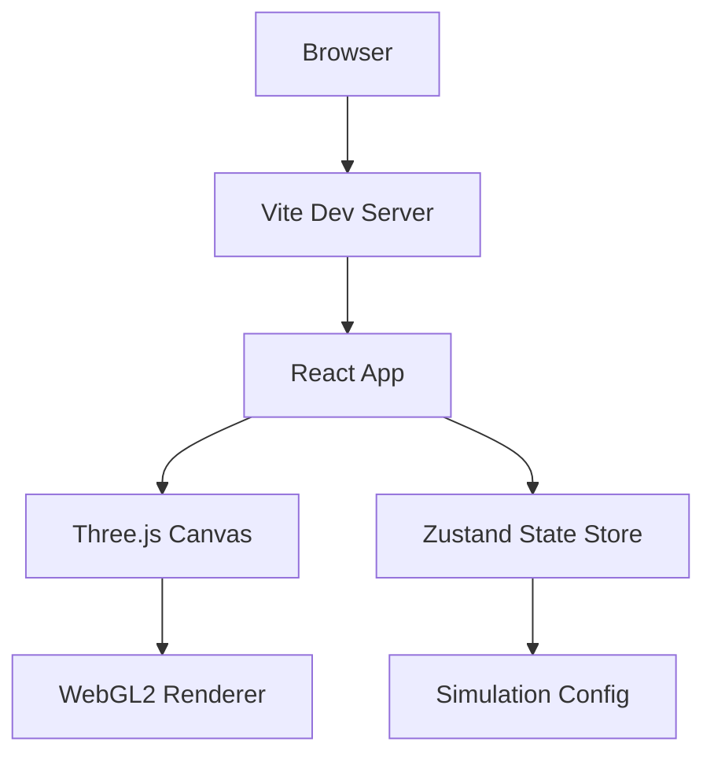
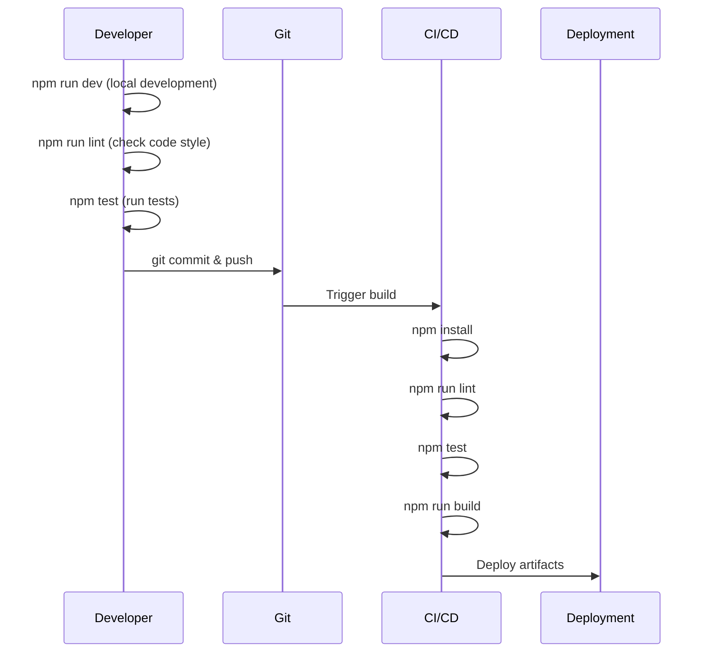
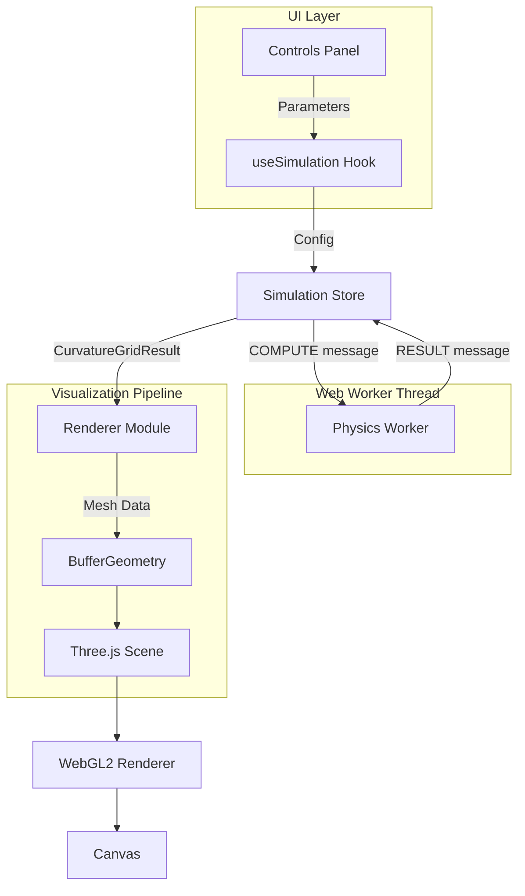
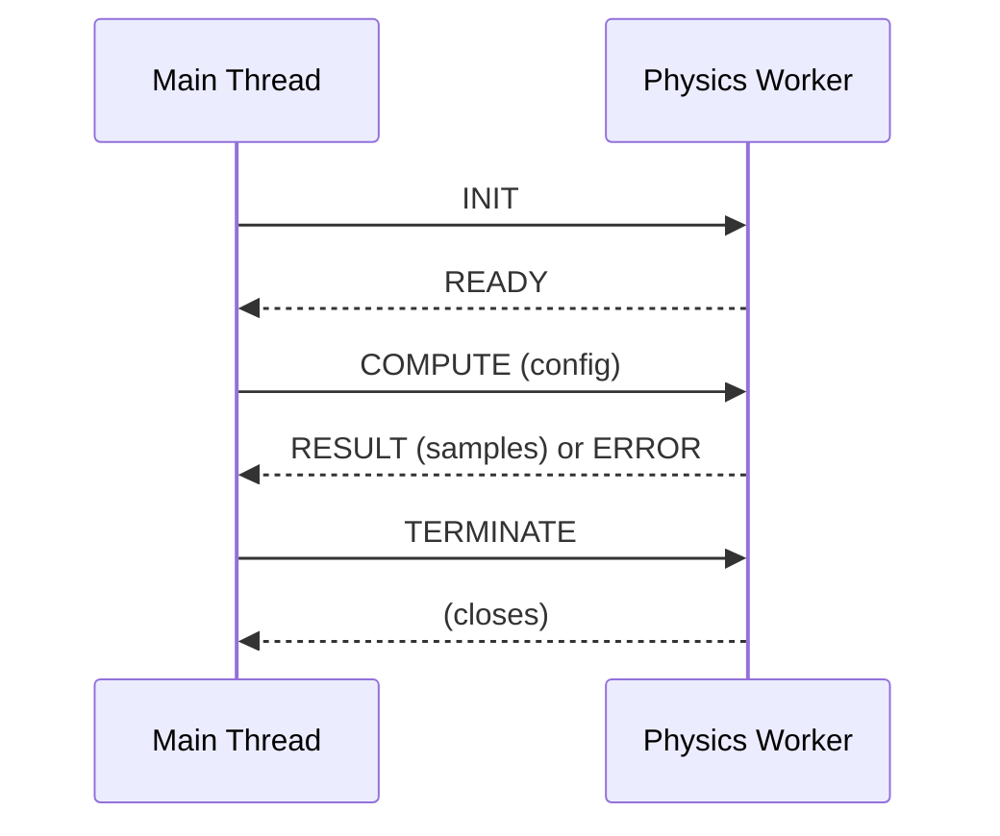
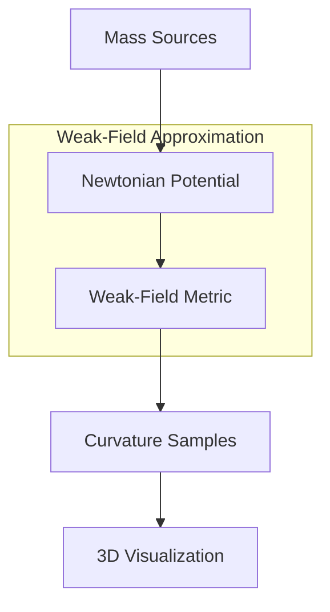

# Spacetime Visualizer

A Three.js-powered web application for visualizing spacetime concepts in an interactive 3D environment.

## Overview



## Features

- **Interactive 3D Visualization**: Powered by Three.js and React Three Fiber
- **Curvature Heightfield Mesh**: Real-time visualization of spacetime curvature with color encoding
- **Simplified Spacetime Curvature**: Physics engine approximating Einstein field equations
- **Responsive Layout**: Adapts to desktop and mobile viewports
- **Configurable Parameters**: Customize grid resolution and animation timestep via environment variables
- **State Management**: Global simulation state with Zustand
- **WebGL2 Detection**: Graceful degradation with warning banner for unsupported browsers
- **Preset Scenarios**: Single mass, binary orbit, triple system, and cluster configurations
- **Camera Controls**: Orbit, zoom, pan, and auto-rotate with desktop/mobile support
- **Debounced Updates**: Performance-optimized parameter changes to prevent physics thrash

## Interactive Controls

### Visualization Modes

Switch between different visualization modes to explore spacetime curvature from different perspectives:

| Mode | Description |
|------|-------------|
| Heightfield Mesh | 3D surface showing curvature depth as height displacement |
| Contour Grid | Equipotential lines showing gravitational field strength |
| Field Lines | Animated particles showing gravitational field direction |

For detailed information about modes and how to add new ones, see [docs/scenarios.md](docs/scenarios.md).

### Scenario Selection

Select from preset scenarios to explore different gravitational configurations:

| Scenario | Description |
|----------|-------------|
| Single Mass | Single centered mass demonstrating spherical symmetry |
| Binary Orbit | Two masses in orbital configuration |
| Gravitational Wave | Quadrupole pattern simulating wave propagation |
| Triple System | Three-body system with complex superposition |
| Mass Cluster | Multiple masses showing aggregate curvature |

**Custom Presets:** You can save your current configuration as a custom preset and load it later. Custom presets are stored in browser local storage.

### Parameter Controls

| Control | Range | Description |
|---------|-------|-------------|
| Grid Resolution | 8-128 | Higher values = smoother mesh but slower performance |
| Mass Scale | 0.1x-5x | Multiplier for all mass values |

### Camera Controls

| Action | Desktop | Mobile |
|--------|---------|--------|
| Orbit | Left-click + drag | One finger drag |
| Zoom | Scroll wheel | Pinch gesture |
| Pan | Right-click + drag | Two finger drag |
| Reset | "Reset Camera" button | "Reset Camera" button |
| Auto-Rotate | Toggle switch | Toggle switch |

### Orbital Motion Controls

Enable dynamic orbital motion for scenarios with defined orbits (e.g., Binary Orbit):

| Control | Function |
|---------|----------|
| Enable Orbits | Toggle orbital motion on/off |
| Reset Time | Reset simulation time to t=0 |
| Time | Displays current simulation time |

**Note:** Orbital motion is only available for scenarios with masses that have orbital parameters defined. The Binary Orbit scenario supports this feature out of the box.

### Playback Controls

| Button | Function |
|--------|----------|
| Play/Pause | Toggle animation |
| Refresh | Force recompute curvature |
| Reset All | Reset to initial state |

### Educational Panel

The expandable educational panel explains the current visualization mode and scenario, helping users understand the physics being displayed. It includes:

- Explanation of the current mode's visualization approach
- Key concepts and physics principles
- Links to relevant documentation

## Requirements

### Browser Requirements

- A modern browser with WebGL2 support:
  - Chrome 56+ (recommended)
  - Firefox 51+
  - Safari 15+
  - Edge 79+

> **Note**: The application will display a warning banner if WebGL2 is not available.

### Development Requirements

- Node.js 18+
- npm 9+

## Getting Started

### Installation

```bash
# Clone the repository
git clone https://github.com/AgentFoundryExamples/spacetime-visualizer.git
cd spacetime-visualizer

# Install dependencies
npm install
```

### Development

```bash
# Start development server with hot reload
npm run dev
```

The app will be available at `http://localhost:5173`

### Production Build

```bash
# Create production build
npm run build

# Preview production build locally
npm run preview
```

### Testing

```bash
# Run tests once
npm test

# Run tests in watch mode
npm run test:watch
```

### Linting and Formatting

```bash
# Run ESLint
npm run lint

# Format code with Prettier
npm run format

# Check formatting without making changes
npm run format:check
```

## Configuration

Configuration is managed through environment variables. Create a `.env` file based on `.env.example`:

```bash
cp .env.example .env
```

### Environment Variables

| Variable | Description | Default | Valid Range |
|----------|-------------|---------|-------------|
| `VITE_GRID_RESOLUTION` | Grid resolution for spacetime visualization (cells per axis) | `32` | 8-256 |
| `VITE_ANIMATION_TIMESTEP` | Animation timestep in seconds | `0.016` | 0.001-0.1 |

> **Note**: All environment variables are optional. The application will use safe defaults if they are not set or contain invalid values.

### Configuration Precedence

1. Environment variables (`.env` file or system environment)
2. Default values defined in `src/state/config.ts`

## Project Structure

```
spacetime-visualizer/
├── docs/
│   └── scenarios.md          # Documentation for modes and scenarios
├── src/
│   ├── components/           # React components
│   │   ├── CanvasWrapper.tsx # Three.js canvas with WebGL handling
│   │   ├── ControlsPanel.tsx # Interactive controls UI
│   │   ├── EducationPanel.tsx # Educational content panel
│   │   ├── Footer.tsx        # Status footer
│   │   ├── ModeSelector.tsx  # Visualization mode selector
│   │   ├── ScenarioLibrary.tsx # Scenario presets and custom saves
│   │   ├── Sidebar.tsx       # Control sidebar
│   │   ├── ThreeCanvas.tsx   # Legacy Three.js canvas wrapper
│   │   └── webgl-utils.ts    # WebGL detection utilities
│   ├── content/
│   │   └── strings.ts        # Localized UI strings
│   ├── hooks/                # React hooks
│   │   └── useSimulation.ts  # Debounced simulation controls
│   ├── physics/              # Physics engine
│   │   ├── types.ts          # MassSource, CurvatureSample types
│   │   ├── curvature.ts      # Curvature computation engine
│   │   └── scenarios.ts      # Preset scenarios and seeding
│   ├── state/
│   │   ├── config.ts         # Zustand store for simulation config
│   │   └── simulation.ts     # Physics simulation state
│   ├── styles/
│   │   ├── controls.css      # Control panel styles
│   │   ├── global.css        # Global reset and variables
│   │   ├── layout.css        # Layout component styles
│   │   └── panels.css        # Mode/scenario panel styles
│   ├── visualization/        # Three.js visualization
│   │   ├── modes/            # Visualization mode renderers
│   │   │   ├── mesh.ts       # Heightfield mesh mode
│   │   │   ├── contour.ts    # Contour grid mode
│   │   │   ├── fieldLines.ts # Field lines mode
│   │   │   ├── types.ts      # Mode interface definitions
│   │   │   └── index.ts      # Mode registry and exports
│   │   ├── materials.ts      # Color mapping and materials
│   │   └── renderer.ts       # Curvature mesh generation
│   ├── workers/              # Web Worker for physics offloading
│   │   ├── types.ts          # Message protocol types
│   │   ├── physics.worker.ts # Physics computation worker
│   │   ├── physics-client.ts # Worker client with fallback
│   │   └── index.ts          # Worker exports
│   ├── test/
│   │   └── setup.ts          # Test setup configuration
│   ├── tests/
│   │   └── curvature.spec.ts # Physics engine tests
│   ├── App.tsx               # Main application component
│   └── main.tsx              # Application entry point
├── .env.example              # Example environment configuration
├── vite.config.ts            # Vite configuration
├── tsconfig.json             # TypeScript configuration
└── package.json              # Dependencies and scripts
```

## Development Workflow



## Troubleshooting

### WebGL2 Not Supported

If you see the "WebGL2 is not supported" warning:

1. Update your browser to the latest version
2. Enable hardware acceleration in browser settings
3. Update your graphics drivers
4. Try a different browser (Chrome is recommended)

### Build Issues

If the build fails:

1. Clear node_modules and reinstall: `rm -rf node_modules && npm install`
2. Clear Vite cache: `rm -rf node_modules/.vite`
3. Ensure Node.js 18+ is installed: `node --version`

### Performance Issues

If the visualization is slow or stuttering:

1. **Lower grid resolution**: Use 32 or less for smooth interaction (default is recommended)
2. **Reduce mass count**: Fewer masses = faster computation
3. **Close other GPU-intensive applications**: Browser GPU resources are shared
4. **Check hardware acceleration**: Ensure your browser is using the GPU

### WebGL Context Loss

The application automatically attempts to restore the WebGL context if it's lost. If this happens frequently:

1. Check for GPU driver updates
2. Close other WebGL/3D applications
3. Reduce browser tab count
4. Consider using a dedicated GPU if available

## Performance Tips

### Recommended Settings by Device

| Device Type | Resolution | Notes |
|-------------|------------|-------|
| High-end desktop | 64-128 | Full detail, smooth |
| Mid-range desktop | 32-64 | Good balance |
| Laptop/Mobile | 16-32 | Best performance |

### Performance Characteristics

| Resolution | Vertices | Expected Compute Time |
|------------|----------|----------------------|
| 16 | 256 | ~1ms |
| 32 | 1,024 | ~10ms |
| 64 | 4,096 | ~50-100ms |
| 128 | 16,384 | ~500ms+ |

> **Warning**: Resolutions above 64 may cause noticeable lag during parameter changes. The UI will display a warning when high resolution is selected.

### Best Practices

1. **Start with lower resolution**: Explore scenarios at resolution 16-32 first
2. **Use presets**: Preset scenarios are optimized for visualization
3. **Pause during adjustments**: Pause animation when adjusting parameters for smoother experience
4. **Batch parameter changes**: The UI automatically debounces rapid changes to prevent excessive recomputation

## Known GPU/Browser Constraints

### Browser-Specific Notes

| Browser | Notes |
|---------|-------|
| Chrome | Recommended. Best WebGL2 performance and compatibility |
| Firefox | Good support. May have slightly different rendering |
| Safari | WebGL2 support from version 15+. Metal backend may affect performance |
| Edge | Chromium-based, similar to Chrome |

### GPU Requirements

- **Minimum**: Any GPU with WebGL2 support (OpenGL ES 3.0 equivalent)
- **Recommended**: Dedicated GPU with 2GB+ VRAM
- **Integrated graphics**: Supported but may require lower resolution settings

### Known Limitations

1. **Mobile devices**: Touch controls work but performance may be limited
2. **Virtual machines**: WebGL may not work correctly in some VM environments
3. **Remote desktop**: GPU acceleration is often disabled over RDP
4. **High-DPI displays**: May require more GPU resources for higher canvas resolution

## Rendering Architecture



### Module Structure

| Module | Purpose |
|--------|---------|
| `visualization/renderer.ts` | Converts curvature data to Three.js geometry |
| `visualization/materials.ts` | Color mapping and material definitions |
| `components/CanvasWrapper.tsx` | React Three Fiber integration |
| `components/ControlsPanel.tsx` | UI controls for parameters |
| `hooks/useSimulation.ts` | Debounced state management |
| `workers/physics.worker.ts` | Physics computation in Web Worker |
| `workers/physics-client.ts` | Worker client with fallback support |

## Web Worker Architecture

Physics computations are offloaded to a dedicated Web Worker to keep the UI responsive during complex simulations. This is especially important for higher grid resolutions and orbital motion.

### Message Protocol



### Message Types

| Message | Direction | Description |
|---------|-----------|-------------|
| `INIT` | Main → Worker | Initialize the worker |
| `READY` | Worker → Main | Worker is ready to receive requests |
| `COMPUTE` | Main → Worker | Request curvature computation with config |
| `RESULT` | Worker → Main | Computation result with samples |
| `ERROR` | Worker → Main | Error with code and message |
| `TERMINATE` | Main → Worker | Clean up and close worker |

### Fallback Mode

When Web Workers are not available (e.g., SSR, older browsers), the physics client automatically falls back to main thread computation. The fallback:

- Uses `setTimeout(0)` to allow UI updates between blocking computations
- Produces identical results to worker-based computation
- Logs a warning when fallback is activated

### Troubleshooting Worker Issues

| Issue | Solution |
|-------|----------|
| Worker fails to initialize | Check browser console for errors; fallback will be used |
| Computation timeout | Reduce grid resolution or simplify scenario |
| "Worker terminated" error | Reset the simulation or reload the page |

## Physics Engine

The physics engine provides a simplified approximation of spacetime curvature based on Einstein's field equations, optimized for educational visualization rather than scientific accuracy.

### Theoretical Background



### Equations

The engine uses the **weak-field approximation** of general relativity, which is valid when gravitational fields are not too strong (i.e., far from black holes or neutron stars).

#### Gravitational Potential

For each point-mass source, the Newtonian gravitational potential is:

```
Φ = -GM/r
```

Where:
- `G` = Gravitational constant (normalized to 1 for visualization)
- `M` = Mass of the source
- `r` = Distance from the source to the sample point

For multiple masses, potentials are superposed:

```
Φ_total = Σ(-GM_i / r_i)
```

#### Metric Deviation

In the weak-field limit, the spacetime metric deviates from flat Minkowski space by:

```
g_00 ≈ -(1 + 2Φ/c²)
```

The metric deviation `h_00 = 2Φ/c²` represents how much time slows down in a gravitational field (gravitational time dilation).

#### Tidal Tensor

The tidal tensor describes the differential gravitational acceleration (how geodesics converge or diverge):

```
T_ij = ∂²Φ / ∂x_i ∂x_j
```

For a point mass, the diagonal components are:

```
T_ii = GM(3x_i² - r²) / r⁵
```

### Data Models

#### MassSource

```typescript
interface MassSource {
  id: string;                           // Unique identifier
  position: [number, number, number];   // 3D position [x, y, z]
  mass: number;                         // Non-negative mass value
  radius?: number;                      // Optional visualization radius
  color?: string;                       // Optional CSS color string
}
```

#### CurvatureSample

```typescript
interface CurvatureSample {
  position: [number, number, number];   // Sample point location
  metricDeviation: number;              // Deviation from flat spacetime
  tidalTensor: [number, number, number]; // Principal tidal forces [Txx, Tyy, Tzz]
}
```

### Configuration

#### Grid Parameters

| Parameter | Description | Default | Range |
|-----------|-------------|---------|-------|
| `resolution` | Grid cells per axis | 16 | 2-256 |
| `bounds` | Spatial extent [minX, minY, minZ, maxX, maxY, maxZ] | [-5,-5,-5,5,5,5] | Finite values |
| `timeStep` | Animation timestep (seconds) | 0.016 | 0.0001-1.0 |

#### Preset Scenarios

The engine includes several preset configurations:

| Preset | Description | Mass Count |
|--------|-------------|------------|
| `single-mass` | Single centered mass showing spherical symmetry | 1 |
| `binary-orbit` | Two masses demonstrating gravitational interaction | 2 |
| `triple-system` | Three-body configuration with complex superposition | 3 |
| `cluster` | Multiple masses showing aggregate curvature | 5 |

Presets use deterministic seeding for reproducibility. The same seed produces identical configurations.

### Usage Example

```typescript
import { computeCurvatureGrid } from './physics/curvature';
import { getScenarioConfig } from './physics/scenarios';

// Load a preset scenario
const config = getScenarioConfig('binary-orbit', 42);

// Compute curvature grid
const result = computeCurvatureGrid(config);

// Access samples
result.samples.forEach(sample => {
  console.log(sample.position, sample.metricDeviation);
});
```

### Assumptions and Limitations

1. **Weak-field approximation**: Valid only for moderate gravitational fields. Does not model black holes or extreme curvature.

2. **Static sources**: Masses are treated as stationary. No gravitational wave propagation.

3. **Point masses**: Sources are idealized points. Finite-size effects are not modeled.

4. **Normalized units**: Uses G = c = 1 for simplicity. Physical values would require dimensional conversion.

5. **Numerical stability**: Distances are clamped to prevent division by zero. Extreme masses may produce clamped values.

### Tuning Knobs

For performance optimization:

- **Lower resolution** (8-16): Faster computation, coarser visualization
- **Higher resolution** (64-128): Smoother gradients, slower computation

For visual effect:

- **Increase mass values**: Stronger curvature, more dramatic visualization
- **Adjust bounds**: Zoom in/out on regions of interest
- **Use multiple masses**: Demonstrate superposition and interaction

### Validation

The engine includes comprehensive validation:

- Non-negative mass values required
- Finite position coordinates required  
- Grid resolution within bounds (2-256)
- Positive grid dimensions required
- Time step within valid range

Invalid configurations throw `CurvatureValidationError` with descriptive messages suitable for UI display.

## Manual Verification Steps

Use these steps to verify the application is working correctly after installation or updates:

### Quick Verification

```bash
# 1. Install dependencies
npm install

# 2. Run linting (should pass with no errors)
npm run lint

# 3. Run tests (should pass all 136 tests)
npm test

# 4. Build for production (should complete without errors)
npm run build
```

### Interactive Verification

1. **Start the development server**:
   ```bash
   npm run dev
   ```

2. **Open the application** at `http://localhost:5173`

3. **Verify initial render**:
   - The 3D visualization canvas should display
   - The heightfield mesh should show curvature from the default scenario
   - No WebGL warning should appear (if WebGL2 is supported)

4. **Test mode switching**:
   - Click on "Contour Grid" mode → should display equipotential lines
   - Click on "Field Lines" mode → should display animated particles
   - Click on "Heightfield Mesh" mode → should return to 3D surface

5. **Test scenario switching**:
   - Select "Binary Orbit" → should show two-mass configuration
   - Select "Gravitational Wave" → should show quadrupole pattern
   - Select "Single Mass" → should return to centered mass

6. **Test parameter controls**:
   - Adjust grid resolution slider → mesh detail should change
   - Adjust mass scale slider → curvature depth should change

7. **Test camera controls**:
   - Left-click and drag → should orbit the camera
   - Scroll wheel → should zoom in/out
   - Click "Reset Camera" → should return to default view

8. **Test playback controls**:
   - Click Play/Pause → animation should toggle
   - Click Refresh → should recompute curvature
   - Click Reset All → should return to initial state

### Production Build Verification

```bash
# Build and preview
npm run build
npm run preview
```

Open `http://localhost:4173` and repeat steps 3-8 above.

## Release Documentation

- [CHANGELOG.md](CHANGELOG.md) - Version history and notable changes
- [docs/roadmap.md](docs/roadmap.md) - Future enhancements and project roadmap
- [docs/scenarios.md](docs/scenarios.md) - Visualization modes and scenario documentation

# Permanents (License, Contributing, Author)

Do not change any of the below sections

## License

This Agent Foundry Project is licensed under the Apache 2.0 License - see the LICENSE file for details.

## Contributing

Feel free to submit issues and enhancement requests!

## Author

Created by Agent Foundry and John Brosnihan
