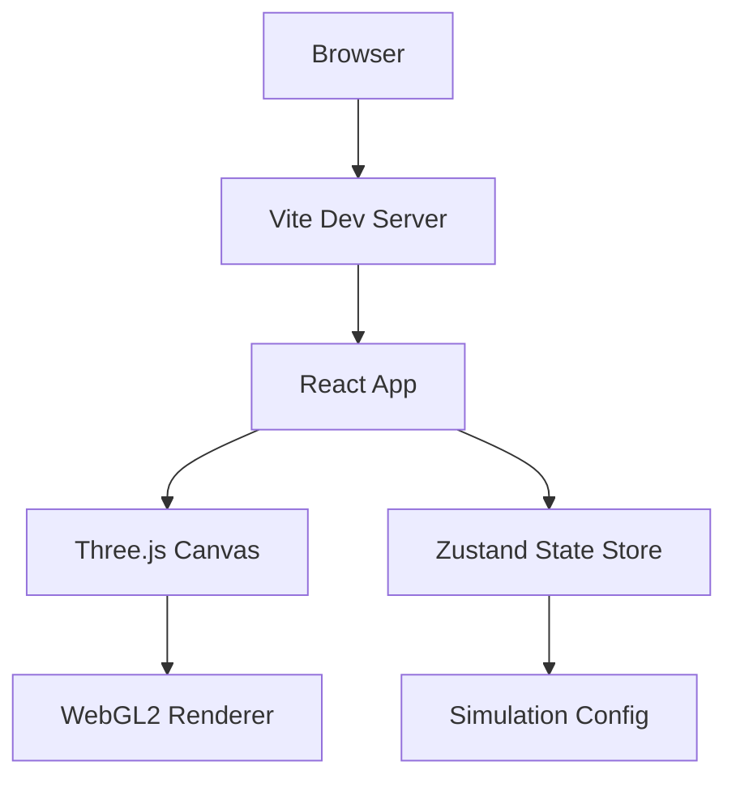
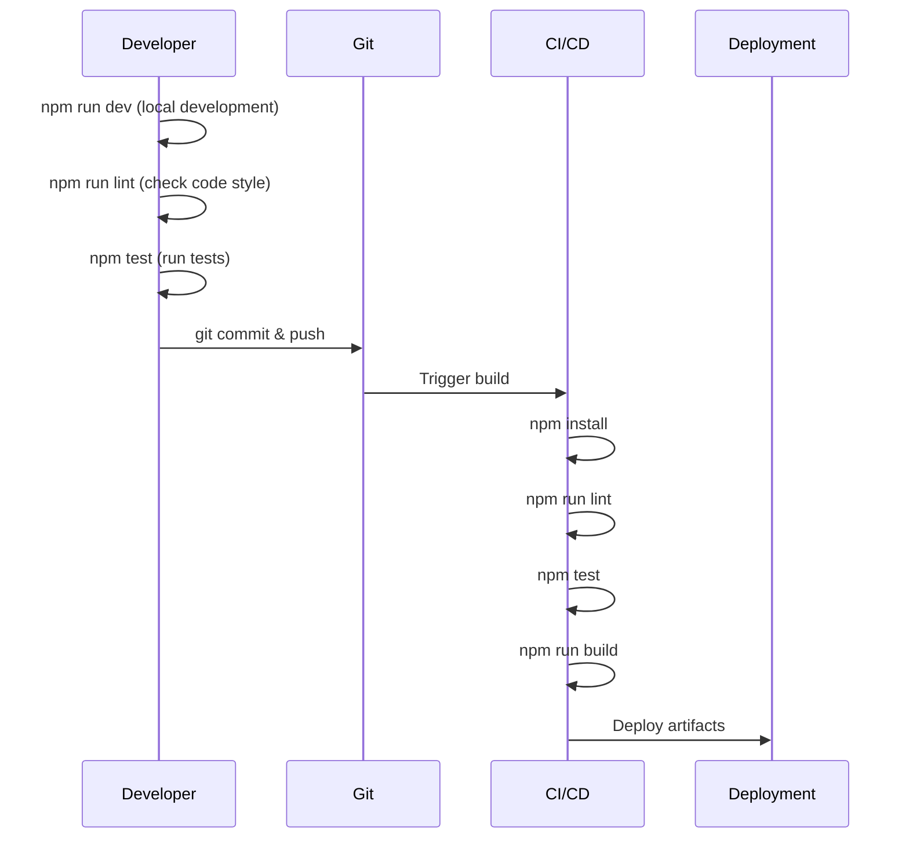

# Spacetime Visualizer

A Three.js-powered web application for visualizing spacetime concepts in an interactive 3D environment.

## Overview



## Features

- **Interactive 3D Visualization**: Powered by Three.js and React Three Fiber
- **Responsive Layout**: Adapts to desktop and mobile viewports
- **Configurable Parameters**: Customize grid resolution and animation timestep via environment variables
- **State Management**: Global simulation state with Zustand
- **WebGL2 Detection**: Graceful degradation with warning banner for unsupported browsers

## Requirements

### Browser Requirements

- A modern browser with WebGL2 support:
  - Chrome 56+ (recommended)
  - Firefox 51+
  - Safari 15+
  - Edge 79+

> **Note**: The application will display a warning banner if WebGL2 is not available.

### Development Requirements

- Node.js 18+
- npm 9+

## Getting Started

### Installation

```bash
# Clone the repository
git clone https://github.com/AgentFoundryExamples/spacetime-visualizer.git
cd spacetime-visualizer

# Install dependencies
npm install
```

### Development

```bash
# Start development server with hot reload
npm run dev
```

The app will be available at `http://localhost:5173`

### Production Build

```bash
# Create production build
npm run build

# Preview production build locally
npm run preview
```

### Testing

```bash
# Run tests once
npm test

# Run tests in watch mode
npm run test:watch
```

### Linting and Formatting

```bash
# Run ESLint
npm run lint

# Format code with Prettier
npm run format

# Check formatting without making changes
npm run format:check
```

## Configuration

Configuration is managed through environment variables. Create a `.env` file based on `.env.example`:

```bash
cp .env.example .env
```

### Environment Variables

| Variable | Description | Default | Valid Range |
|----------|-------------|---------|-------------|
| `VITE_GRID_RESOLUTION` | Grid resolution for spacetime visualization (cells per axis) | `32` | 8-256 |
| `VITE_ANIMATION_TIMESTEP` | Animation timestep in seconds | `0.016` | 0.001-0.1 |

> **Note**: All environment variables are optional. The application will use safe defaults if they are not set or contain invalid values.

### Configuration Precedence

1. Environment variables (`.env` file or system environment)
2. Default values defined in `src/state/config.ts`

## Project Structure

```
spacetime-visualizer/
├── src/
│   ├── components/         # React components
│   │   ├── Footer.tsx      # Status footer
│   │   ├── Sidebar.tsx     # Control sidebar
│   │   ├── ThreeCanvas.tsx # Three.js canvas wrapper
│   │   └── webgl-utils.ts  # WebGL detection utilities
│   ├── state/
│   │   └── config.ts       # Zustand store for simulation config
│   ├── styles/
│   │   ├── global.css      # Global reset and variables
│   │   └── layout.css      # Layout component styles
│   ├── test/
│   │   └── setup.ts        # Test setup configuration
│   ├── App.tsx             # Main application component
│   └── main.tsx            # Application entry point
├── .env.example            # Example environment configuration
├── vite.config.ts          # Vite configuration
├── tsconfig.json           # TypeScript configuration
└── package.json            # Dependencies and scripts
```

## Development Workflow



## Troubleshooting

### WebGL2 Not Supported

If you see the "WebGL2 is not supported" warning:

1. Update your browser to the latest version
2. Enable hardware acceleration in browser settings
3. Update your graphics drivers
4. Try a different browser (Chrome is recommended)

### Build Issues

If the build fails:

1. Clear node_modules and reinstall: `rm -rf node_modules && npm install`
2. Clear Vite cache: `rm -rf node_modules/.vite`
3. Ensure Node.js 18+ is installed: `node --version`

# Permanents (License, Contributing, Author)

Do not change any of the below sections

## License

This Agent Foundry Project is licensed under the Apache 2.0 License - see the LICENSE file for details.

## Contributing

Feel free to submit issues and enhancement requests!

## Author

Created by Agent Foundry and John Brosnihan
