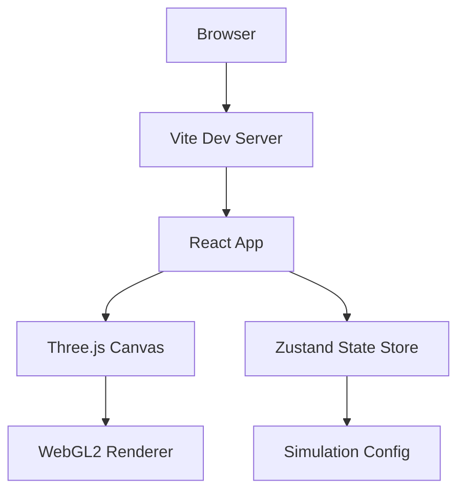
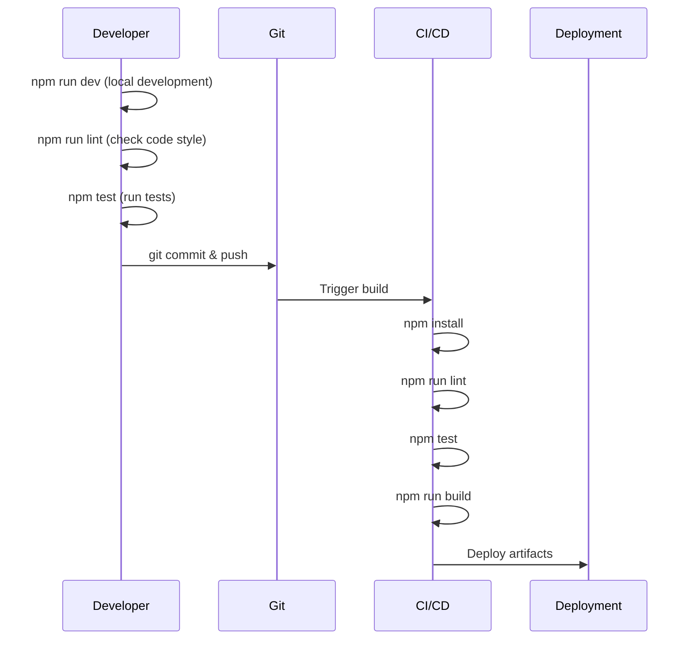
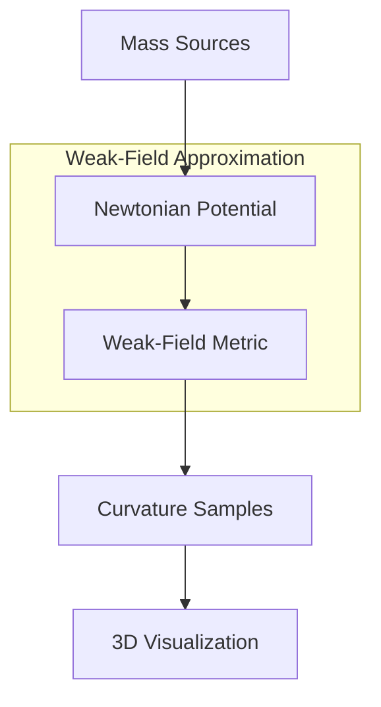

# Spacetime Visualizer

A Three.js-powered web application for visualizing spacetime concepts in an interactive 3D environment.

## Overview



## Features

- **Interactive 3D Visualization**: Powered by Three.js and React Three Fiber
- **Simplified Spacetime Curvature**: Physics engine approximating Einstein field equations
- **Responsive Layout**: Adapts to desktop and mobile viewports
- **Configurable Parameters**: Customize grid resolution and animation timestep via environment variables
- **State Management**: Global simulation state with Zustand
- **WebGL2 Detection**: Graceful degradation with warning banner for unsupported browsers
- **Preset Scenarios**: Single mass, binary orbit, triple system, and cluster configurations

## Requirements

### Browser Requirements

- A modern browser with WebGL2 support:
  - Chrome 56+ (recommended)
  - Firefox 51+
  - Safari 15+
  - Edge 79+

> **Note**: The application will display a warning banner if WebGL2 is not available.

### Development Requirements

- Node.js 18+
- npm 9+

## Getting Started

### Installation

```bash
# Clone the repository
git clone https://github.com/AgentFoundryExamples/spacetime-visualizer.git
cd spacetime-visualizer

# Install dependencies
npm install
```

### Development

```bash
# Start development server with hot reload
npm run dev
```

The app will be available at `http://localhost:5173`

### Production Build

```bash
# Create production build
npm run build

# Preview production build locally
npm run preview
```

### Testing

```bash
# Run tests once
npm test

# Run tests in watch mode
npm run test:watch
```

### Linting and Formatting

```bash
# Run ESLint
npm run lint

# Format code with Prettier
npm run format

# Check formatting without making changes
npm run format:check
```

## Configuration

Configuration is managed through environment variables. Create a `.env` file based on `.env.example`:

```bash
cp .env.example .env
```

### Environment Variables

| Variable | Description | Default | Valid Range |
|----------|-------------|---------|-------------|
| `VITE_GRID_RESOLUTION` | Grid resolution for spacetime visualization (cells per axis) | `32` | 8-256 |
| `VITE_ANIMATION_TIMESTEP` | Animation timestep in seconds | `0.016` | 0.001-0.1 |

> **Note**: All environment variables are optional. The application will use safe defaults if they are not set or contain invalid values.

### Configuration Precedence

1. Environment variables (`.env` file or system environment)
2. Default values defined in `src/state/config.ts`

## Project Structure

```
spacetime-visualizer/
├── src/
│   ├── components/         # React components
│   │   ├── Footer.tsx      # Status footer
│   │   ├── Sidebar.tsx     # Control sidebar
│   │   ├── ThreeCanvas.tsx # Three.js canvas wrapper
│   │   └── webgl-utils.ts  # WebGL detection utilities
│   ├── physics/            # Physics engine
│   │   ├── types.ts        # MassSource, CurvatureSample types
│   │   ├── curvature.ts    # Curvature computation engine
│   │   └── scenarios.ts    # Preset scenarios and seeding
│   ├── state/
│   │   ├── config.ts       # Zustand store for simulation config
│   │   └── simulation.ts   # Physics simulation state
│   ├── styles/
│   │   ├── global.css      # Global reset and variables
│   │   └── layout.css      # Layout component styles
│   ├── test/
│   │   └── setup.ts        # Test setup configuration
│   ├── tests/
│   │   └── curvature.spec.ts # Physics engine tests
│   ├── App.tsx             # Main application component
│   └── main.tsx            # Application entry point
├── .env.example            # Example environment configuration
├── vite.config.ts          # Vite configuration
├── tsconfig.json           # TypeScript configuration
└── package.json            # Dependencies and scripts
```

## Development Workflow



## Troubleshooting

### WebGL2 Not Supported

If you see the "WebGL2 is not supported" warning:

1. Update your browser to the latest version
2. Enable hardware acceleration in browser settings
3. Update your graphics drivers
4. Try a different browser (Chrome is recommended)

### Build Issues

If the build fails:

1. Clear node_modules and reinstall: `rm -rf node_modules && npm install`
2. Clear Vite cache: `rm -rf node_modules/.vite`
3. Ensure Node.js 18+ is installed: `node --version`

## Physics Engine

The physics engine provides a simplified approximation of spacetime curvature based on Einstein's field equations, optimized for educational visualization rather than scientific accuracy.

### Theoretical Background



### Equations

The engine uses the **weak-field approximation** of general relativity, which is valid when gravitational fields are not too strong (i.e., far from black holes or neutron stars).

#### Gravitational Potential

For each point-mass source, the Newtonian gravitational potential is:

```
Φ = -GM/r
```

Where:
- `G` = Gravitational constant (normalized to 1 for visualization)
- `M` = Mass of the source
- `r` = Distance from the source to the sample point

For multiple masses, potentials are superposed:

```
Φ_total = Σ(-GM_i / r_i)
```

#### Metric Deviation

In the weak-field limit, the spacetime metric deviates from flat Minkowski space by:

```
g_00 ≈ -(1 + 2Φ/c²)
```

The metric deviation `h_00 = 2Φ/c²` represents how much time slows down in a gravitational field (gravitational time dilation).

#### Tidal Tensor

The tidal tensor describes the differential gravitational acceleration (how geodesics converge or diverge):

```
T_ij = ∂²Φ / ∂x_i ∂x_j
```

For a point mass, the diagonal components are:

```
T_ii = GM(3x_i² - r²) / r⁵
```

### Data Models

#### MassSource

```typescript
interface MassSource {
  id: string;                           // Unique identifier
  position: [number, number, number];   // 3D position [x, y, z]
  mass: number;                         // Non-negative mass value
  radius?: number;                      // Optional visualization radius
  color?: string;                       // Optional CSS color string
}
```

#### CurvatureSample

```typescript
interface CurvatureSample {
  position: [number, number, number];   // Sample point location
  metricDeviation: number;              // Deviation from flat spacetime
  tidalTensor: [number, number, number]; // Principal tidal forces [Txx, Tyy, Tzz]
}
```

### Configuration

#### Grid Parameters

| Parameter | Description | Default | Range |
|-----------|-------------|---------|-------|
| `resolution` | Grid cells per axis | 16 | 2-256 |
| `bounds` | Spatial extent [minX, minY, minZ, maxX, maxY, maxZ] | [-5,-5,-5,5,5,5] | Finite values |
| `timeStep` | Animation timestep (seconds) | 0.016 | 0.0001-1.0 |

#### Preset Scenarios

The engine includes several preset configurations:

| Preset | Description | Mass Count |
|--------|-------------|------------|
| `single-mass` | Single centered mass showing spherical symmetry | 1 |
| `binary-orbit` | Two masses demonstrating gravitational interaction | 2 |
| `triple-system` | Three-body configuration with complex superposition | 3 |
| `cluster` | Multiple masses showing aggregate curvature | 5 |

Presets use deterministic seeding for reproducibility. The same seed produces identical configurations.

### Usage Example

```typescript
import { computeCurvatureGrid } from './physics/curvature';
import { getScenarioConfig } from './physics/scenarios';

// Load a preset scenario
const config = getScenarioConfig('binary-orbit', 42);

// Compute curvature grid
const result = computeCurvatureGrid(config);

// Access samples
result.samples.forEach(sample => {
  console.log(sample.position, sample.metricDeviation);
});
```

### Assumptions and Limitations

1. **Weak-field approximation**: Valid only for moderate gravitational fields. Does not model black holes or extreme curvature.

2. **Static sources**: Masses are treated as stationary. No gravitational wave propagation.

3. **Point masses**: Sources are idealized points. Finite-size effects are not modeled.

4. **Normalized units**: Uses G = c = 1 for simplicity. Physical values would require dimensional conversion.

5. **Numerical stability**: Distances are clamped to prevent division by zero. Extreme masses may produce clamped values.

### Tuning Knobs

For performance optimization:

- **Lower resolution** (8-16): Faster computation, coarser visualization
- **Higher resolution** (64-128): Smoother gradients, slower computation

For visual effect:

- **Increase mass values**: Stronger curvature, more dramatic visualization
- **Adjust bounds**: Zoom in/out on regions of interest
- **Use multiple masses**: Demonstrate superposition and interaction

### Validation

The engine includes comprehensive validation:

- Non-negative mass values required
- Finite position coordinates required  
- Grid resolution within bounds (2-256)
- Positive grid dimensions required
- Time step within valid range

Invalid configurations throw `CurvatureValidationError` with descriptive messages suitable for UI display.

# Permanents (License, Contributing, Author)

Do not change any of the below sections

## License

This Agent Foundry Project is licensed under the Apache 2.0 License - see the LICENSE file for details.

## Contributing

Feel free to submit issues and enhancement requests!

## Author

Created by Agent Foundry and John Brosnihan
