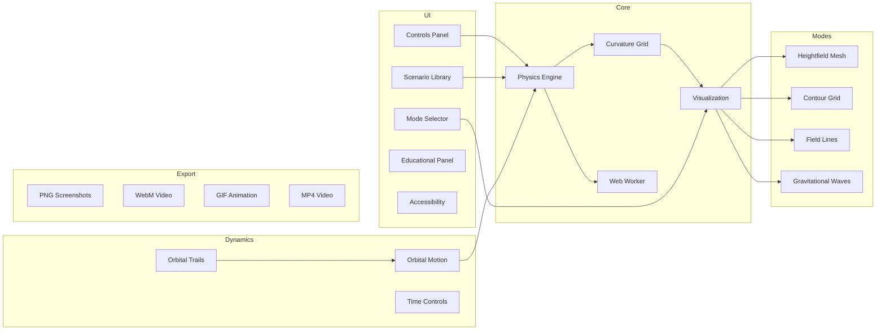

# Roadmap

This document outlines the current status of the Spacetime Visualizer project and planned future enhancements.

## Current Status (v0.3.0)

The v0.3.0 release includes gravitational wave visualization, orbital trails, GIF/MP4 export support, and orbital motion bug fixes.

### Completed Features

| Feature | Status | Version | Notes |
|---------|--------|---------|-------|
| Vite/React/TypeScript scaffolding | ✅ Complete | v0.1.0 | Production-ready build |
| Physics engine (weak-field) | ✅ Complete | v0.1.0 | Supports multiple masses |
| Heightfield mesh mode | ✅ Complete | v0.1.0 | Default visualization |
| Contour grid mode | ✅ Complete | v0.1.0 | Equipotential lines |
| Field lines mode | ✅ Complete | v0.1.0 | Animated particles |
| Basic preset scenarios | ✅ Complete | v0.1.0 | 5 built-in presets |
| Custom presets | ✅ Complete | v0.1.0 | Local storage persistence |
| Camera controls | ✅ Complete | v0.1.0 | Orbit/zoom/pan/auto-rotate |
| Playback controls | ✅ Complete | v0.1.0 | Play/pause/refresh/reset |
| Educational content | ✅ Complete | v0.1.0 | Mode and scenario explanations |
| Environment configuration | ✅ Complete | v0.1.0 | Grid resolution and timestep |
| WebGL2 detection | ✅ Complete | v0.1.0 | Graceful degradation |
| Dynamic orbital motion | ✅ Complete | v0.2.0 | Keplerian orbits for binary systems |
| Physics Web Worker | ✅ Complete | v0.2.0 | Offloaded physics for UI responsiveness |
| Advanced scenarios | ✅ Complete | v0.2.0 | Lensing, EMRI, hierarchical, inspiral |
| PNG screenshot export | ✅ Complete | v0.2.0 | Canvas capture to PNG |
| WebM video recording | ✅ Complete | v0.2.0 | 1-30s recordings with MediaRecorder |
| Accessibility | ✅ Complete | v0.2.0 | WCAG 2.1 AA, keyboard nav, screen readers |
| **Gravitational wave mode** | ✅ Complete | v0.3.0 | Animated wave propagation visualization |
| **Orbital trails** | ✅ Complete | v0.3.0 | Trail history for moving masses |
| **GIF animation export** | ✅ Complete | v0.3.0 | Frame-by-frame capture to GIF |
| **MP4 video export** | ✅ Complete | v0.3.0 | H.264 with WebM fallback |
| **Orbital motion fixes** | ✅ Complete | v0.3.0 | Pause/resume, tab-switch handling |
| Test coverage | ✅ Complete | v0.3.0 | 314 passing tests |

### Known Limitations

- Physics uses weak-field approximation (not suitable for extreme gravity)
- Orbital decay (inspiral) is not simulated; orbits are static Keplerian
- Point mass model only (no extended objects)
- High grid resolutions (64+) may impact performance
- Video export requires MediaRecorder API support
- GIF exports limited to 10 seconds due to memory constraints
- Gravitational wave animation is simplified (not full GR propagation)

## Future Iterations

### Short-term (v0.4.0)

| Enhancement | Priority | Description |
|-------------|----------|-------------|
| Preset scenario editor | High | GUI for creating custom scenarios |
| Mobile optimizations | High | Touch-friendly controls and reduced defaults |
| Advanced wave controls | Medium | Phase, polarization, and source position options |
| Trail styling options | Medium | Color gradients, thickness, and line styles |

### Deferred Features

The following features were originally planned for earlier versions but have been deferred to allow focus on core functionality. See the v0.5.0 section below for their current placement:

| Feature | Original Target | New Target | Reason |
|---------|-----------------|------------|--------|
| VR/AR support | v0.4.0 | v0.5.0 | Requires WebXR infrastructure |
| Multi-user collaboration | v0.4.0 | v0.5.0 | Backend development needed |
| Internationalization | v0.4.0 | v0.5.0 | Lower priority than core features |

### Medium-term (v0.5.0)

| Enhancement | Priority | Description |
|-------------|----------|-------------|
| VR/AR support | High | WebXR integration for immersive viewing |
| Multi-user collaboration | Medium | Shared visualization sessions |
| API for embedding | Medium | Component library for other projects |
| Internationalization | Low | Multi-language support |

### Long-term (v1.0.0)

| Enhancement | Priority | Description |
|-------------|----------|-------------|
| Strong-field physics | High | Support for black hole visualization |
| GPU-accelerated physics | Medium | WebGPU compute shaders |
| Educational curriculum | Medium | Guided lessons and quizzes |
| Mobile app | Low | Native iOS/Android applications |

## Contributing

We welcome contributions! Priority areas include:

1. **Performance**: WebWorker offloading, geometry instancing
2. **Visualization**: New modes, improved materials
3. **Education**: Content, tutorials, explanations
4. **Accessibility**: Keyboard support, ARIA labels

See [README.md](../README.md) for development setup instructions.

## Feedback

- Open an issue for bug reports or feature requests
- Discussions are welcome for architecture proposals
- PRs should include tests for new functionality
