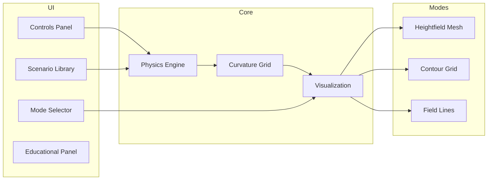

# Roadmap

This document outlines the current status of the Spacetime Visualizer project and planned future enhancements.

## Current Status (v0.1.0)

The initial release includes a functional 3D spacetime curvature visualizer with the following capabilities:

### Completed Features

| Feature | Status | Notes |
|---------|--------|-------|
| Vite/React/TypeScript scaffolding | ✅ Complete | Production-ready build |
| Physics engine (weak-field) | ✅ Complete | Supports multiple masses |
| Heightfield mesh mode | ✅ Complete | Default visualization |
| Contour grid mode | ✅ Complete | Equipotential lines |
| Field lines mode | ✅ Complete | Animated particles |
| Preset scenarios | ✅ Complete | 5 built-in presets |
| Custom presets | ✅ Complete | Local storage persistence |
| Camera controls | ✅ Complete | Orbit/zoom/pan/auto-rotate |
| Playback controls | ✅ Complete | Play/pause/refresh/reset |
| Educational content | ✅ Complete | Mode and scenario explanations |
| Environment configuration | ✅ Complete | Grid resolution and timestep |
| WebGL2 detection | ✅ Complete | Graceful degradation |
| Test coverage | ✅ Complete | 136 passing tests |

### Known Limitations

- Physics uses weak-field approximation (not suitable for extreme gravity)
- Masses are static (no orbital dynamics or gravitational waves)
- Point mass model only (no extended objects)
- High grid resolutions (64+) may impact performance

## Future Iterations

### Short-term (v0.2.0)

| Enhancement | Priority | Description |
|-------------|----------|-------------|
| Dynamic mass orbits | High | Animate masses in orbital motion |
| Performance optimization | High | WebWorker for physics computation |
| Additional scenarios | Medium | More preset configurations |
| Export capabilities | Medium | Export images/videos of visualizations |
| Accessibility improvements | Medium | Keyboard navigation, screen reader support |

### Medium-term (v0.3.0)

| Enhancement | Priority | Description |
|-------------|----------|-------------|
| Gravitational wave animation | High | True wave propagation visualization |
| VR/AR support | Medium | WebXR integration for immersive viewing |
| Multi-user collaboration | Low | Shared visualization sessions |
| API for embedding | Medium | Component library for other projects |

### Long-term (v1.0.0)

| Enhancement | Priority | Description |
|-------------|----------|-------------|
| Strong-field physics | High | Support for black hole visualization |
| GPU-accelerated physics | Medium | WebGPU compute shaders |
| Educational curriculum | Medium | Guided lessons and quizzes |
| Mobile app | Low | Native iOS/Android applications |

## Contributing

We welcome contributions! Priority areas include:

1. **Performance**: WebWorker offloading, geometry instancing
2. **Visualization**: New modes, improved materials
3. **Education**: Content, tutorials, explanations
4. **Accessibility**: Keyboard support, ARIA labels

See [README.md](../README.md) for development setup instructions.

## Feedback

- Open an issue for bug reports or feature requests
- Discussions are welcome for architecture proposals
- PRs should include tests for new functionality
