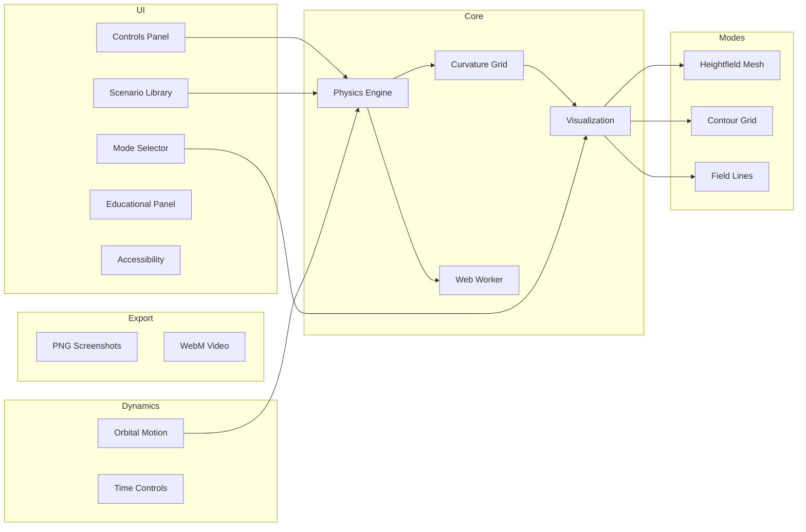

# Roadmap

This document outlines the current status of the Spacetime Visualizer project and planned future enhancements.

## Current Status (v0.2.0)

The v0.2.0 release includes dynamic orbital motion, performance optimizations, new scenarios, export capabilities, and comprehensive accessibility features.

### Completed Features

| Feature | Status | Version | Notes |
|---------|--------|---------|-------|
| Vite/React/TypeScript scaffolding | ✅ Complete | v0.1.0 | Production-ready build |
| Physics engine (weak-field) | ✅ Complete | v0.1.0 | Supports multiple masses |
| Heightfield mesh mode | ✅ Complete | v0.1.0 | Default visualization |
| Contour grid mode | ✅ Complete | v0.1.0 | Equipotential lines |
| Field lines mode | ✅ Complete | v0.1.0 | Animated particles |
| Basic preset scenarios | ✅ Complete | v0.1.0 | 5 built-in presets |
| Custom presets | ✅ Complete | v0.1.0 | Local storage persistence |
| Camera controls | ✅ Complete | v0.1.0 | Orbit/zoom/pan/auto-rotate |
| Playback controls | ✅ Complete | v0.1.0 | Play/pause/refresh/reset |
| Educational content | ✅ Complete | v0.1.0 | Mode and scenario explanations |
| Environment configuration | ✅ Complete | v0.1.0 | Grid resolution and timestep |
| WebGL2 detection | ✅ Complete | v0.1.0 | Graceful degradation |
| **Dynamic orbital motion** | ✅ Complete | v0.2.0 | Keplerian orbits for binary systems |
| **Physics Web Worker** | ✅ Complete | v0.2.0 | Offloaded physics for UI responsiveness |
| **Advanced scenarios** | ✅ Complete | v0.2.0 | Lensing, EMRI, hierarchical, inspiral |
| **PNG screenshot export** | ✅ Complete | v0.2.0 | Canvas capture to PNG |
| **WebM video recording** | ✅ Complete | v0.2.0 | 1-30s recordings with MediaRecorder |
| **Accessibility** | ✅ Complete | v0.2.0 | WCAG 2.1 AA, keyboard nav, screen readers |
| Test coverage | ✅ Complete | v0.2.0 | 242 passing tests |

### Known Limitations

- Physics uses weak-field approximation (not suitable for extreme gravity)
- Orbital decay (inspiral) is not simulated; orbits are static Keplerian
- Point mass model only (no extended objects)
- High grid resolutions (64+) may impact performance
- Video export requires MediaRecorder API support

## Future Iterations

### Short-term (v0.3.0)

| Enhancement | Priority | Description |
|-------------|----------|-------------|
| Gravitational wave animation | High | True wave propagation visualization |
| Orbit trail visualization | High | Show historical paths of orbiting masses |
| Preset scenario editor | Medium | GUI for creating custom scenarios |
| Export format options | Medium | Additional formats (GIF, MP4) |
| Mobile optimizations | Medium | Touch-friendly controls and reduced defaults |

### Medium-term (v0.4.0)

| Enhancement | Priority | Description |
|-------------|----------|-------------|
| VR/AR support | High | WebXR integration for immersive viewing |
| Multi-user collaboration | Medium | Shared visualization sessions |
| API for embedding | Medium | Component library for other projects |
| Internationalization | Low | Multi-language support |

### Long-term (v1.0.0)

| Enhancement | Priority | Description |
|-------------|----------|-------------|
| Strong-field physics | High | Support for black hole visualization |
| GPU-accelerated physics | Medium | WebGPU compute shaders |
| Educational curriculum | Medium | Guided lessons and quizzes |
| Mobile app | Low | Native iOS/Android applications |

## Contributing

We welcome contributions! Priority areas include:

1. **Performance**: WebWorker offloading, geometry instancing
2. **Visualization**: New modes, improved materials
3. **Education**: Content, tutorials, explanations
4. **Accessibility**: Keyboard support, ARIA labels

See [README.md](../README.md) for development setup instructions.

## Feedback

- Open an issue for bug reports or feature requests
- Discussions are welcome for architecture proposals
- PRs should include tests for new functionality
