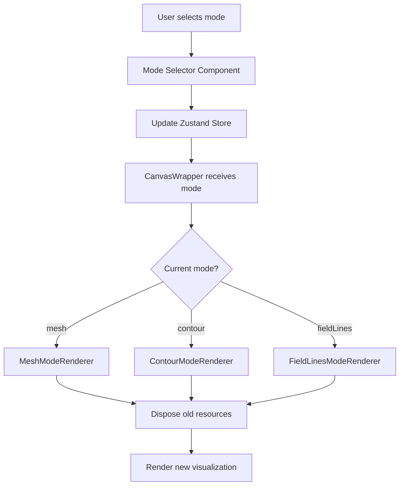
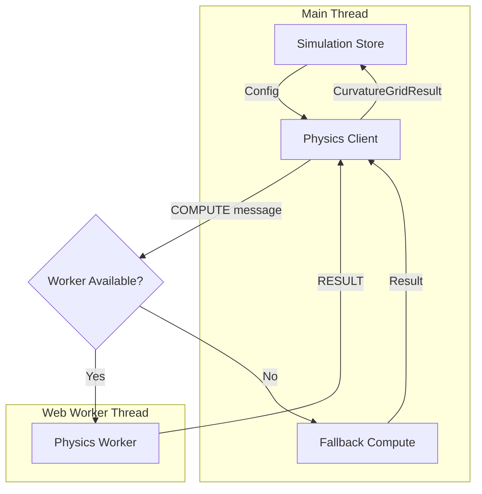

# Scenarios and Visualization Modes

This document details the available visualization modes, preset scenarios, and how to customize them in the Spacetime Visualizer.

## Table of Contents

- [Visualization Modes](#visualization-modes)
  - [Heightfield Mesh](#heightfield-mesh)
  - [Contour Grid](#contour-grid)
  - [Field Lines](#field-lines)
- [Preset Scenarios](#preset-scenarios)
  - [Single Mass](#single-mass)
  - [Binary Orbit](#binary-orbit)
  - [Gravitational Wave](#gravitational-wave)
  - [Triple System](#triple-system)
  - [Mass Cluster](#mass-cluster)
  - [Gravitational Lensing](#gravitational-lensing) (v0.2)
  - [Extreme Mass Ratio](#extreme-mass-ratio) (v0.2)
  - [Hierarchical Triple](#hierarchical-triple) (v0.2)
  - [Black Hole Inspiral](#black-hole-inspiral) (v0.2)
- [Custom Presets](#custom-presets)
- [Physics Worker Architecture](#physics-worker-architecture)
- [Adding New Modes](#adding-new-modes)
- [Adding New Scenarios](#adding-new-scenarios)
- [Data Contracts](#data-contracts)

## Visualization Modes

The application supports three visualization modes for displaying spacetime curvature. Each mode provides a different perspective on the same underlying physics data.

### Mode Switching Architecture



### Heightfield Mesh

The default mode displaying curvature as a 3D surface.

**Key Features:**
- Z-displacement based on gravitational potential
- Color gradient from blue (flat) to red (curved)
- Supports incremental updates for better performance
- Uses area-weighted normal computation

**Best for:** Understanding the "rubber sheet" analogy of spacetime curvature.

### Contour Grid

Displays equipotential lines similar to topographic maps.

**Key Features:**
- 10 contour levels by default
- Marching squares algorithm for line extraction
- Color-coded by potential value
- Semi-transparent reference plane

**Best for:** Understanding gravitational potential gradients.

### Field Lines

Animated particles showing gravitational field direction.

**Key Features:**
- 32 field lines starting from circular distribution
- Gradient-based integration for line tracing
- Directional arrowheads
- Bilinear interpolation for smooth gradients

**Best for:** Understanding gravitational force direction.

## Preset Scenarios

### Single Mass

A single point mass at the center demonstrating spherically symmetric curvature.

| Property | Value |
|----------|-------|
| Mass Count | 1 |
| Mass Value | ~100 (with variation) |
| Position | Center (0, 0, 0) |

**Physics:** Demonstrates the Schwarzschild metric in the weak-field approximation.

### Binary Orbit

Two masses in orbital configuration showing gravitational interaction. This scenario supports **dynamic orbital motion** - enable orbits in the controls to see the masses revolve around their common center of mass.

| Property | Value |
|----------|-------|
| Mass Count | 2 |
| Separation | 2-4 units |
| Mass Ratio | 0.5-1.0 |
| Orbital Motion | Supported |

**Physics:** Shows potential superposition and Lagrange points. When orbits are enabled, masses follow Keplerian orbital trajectories around their barycenter.

### Gravitational Wave

A quadrupole pattern simulating gravitational wave effects.

| Property | Value |
|----------|-------|
| Mass Count | 4 |
| Pattern | Quadrupole |
| Radius | ~2.5 units |

**Physics:** Educational approximation of gravitational wave patterns.

### Triple System

Three masses in triangular configuration.

| Property | Value |
|----------|-------|
| Mass Count | 3 |
| Pattern | Equilateral triangle |
| Radius | 2-3.5 units |

**Physics:** Demonstrates the complexity of three-body gravitational interaction.

### Mass Cluster

Multiple masses distributed in a cluster.

| Property | Value |
|----------|-------|
| Mass Count | 5 |
| Distribution | Spherical |
| Radius | ~3 units |

**Physics:** Shows aggregate curvature and shell theorem principles.

### Gravitational Lensing

A single massive object demonstrating deep spacetime curvature (v0.2).

| Property | Value |
|----------|-------|
| Mass Count | 1 |
| Mass Value | ~200 (with variation) |
| Position | Center (0, 0, 0) |
| Orbital Motion | N/A |

**Physics:** Demonstrates light bending due to extreme curvature. In full GR, photon paths curve around massive objects, creating lensing effects used to detect dark matter.

**Limitations:** This is a visualization of curvature depth, not actual ray-traced lensing.

### Extreme Mass Ratio

A binary system with vastly different masses (~100:1 ratio) (v0.2).

| Property | Value |
|----------|-------|
| Mass Count | 2 |
| Primary Mass | ~150 |
| Secondary Mass | ~1.5 |
| Mass Ratio | ~100:1 |
| Orbital Motion | Supported (secondary only) |

**Physics:** Similar to EMRI (Extreme Mass Ratio Inspiral) systems detected by LISA. The secondary barely perturbs the primary's gravitational field.

**Limitations:** Orbital evolution (inspiral) is not simulated; orbits are static Keplerian.

### Hierarchical Triple

A close inner binary orbiting a more massive outer body (v0.2).

| Property | Value |
|----------|-------|
| Mass Count | 3 |
| Tertiary Mass | ~120 |
| Inner Binary Masses | ~40 each |
| Outer Radius | ~3 units |
| Inner Separation | ~0.8-1.1 units |
| Orbital Motion | N/A (static configuration) |

**Physics:** Demonstrates two-scale gravitational dynamics. Kozai-Lidov oscillations can occur in such systems, exchanging eccentricity and inclination over long timescales.

**Limitations:** Full three-body dynamics with orbital evolution is not implemented.

### Black Hole Inspiral

Two equal masses in tight orbit, simulating pre-merger dynamics (v0.2).

| Property | Value |
|----------|-------|
| Mass Count | 2 |
| Mass 1 | ~80 |
| Mass 2 | ~72-88 |
| Separation | ~1.2-1.5 units |
| Orbital Motion | Supported |

**Physics:** Represents the late inspiral phase of binary black hole mergers, like those detected by LIGO/Virgo. Energy is radiated as gravitational waves, causing orbital decay.

**Limitations:** Orbital decay (Peters-Mathews formalism) and merger are not simulated.

## Orbital Motion

The Spacetime Visualizer supports animated orbital motion for masses with defined orbital parameters.

### Enabling Orbits

1. Select a scenario that supports orbital motion (e.g., Binary Orbit)
2. In the Controls panel, find the **Orbital Motion** section
3. Toggle **Enable Orbits** to start the animation
4. The curvature visualization updates in real-time as masses move

### Orbital Parameters

Each mass can have the following orbital parameters:

| Parameter | Description | Range |
|-----------|-------------|-------|
| Semi-major axis | Orbital size in simulation units | 0.5-10 |
| Eccentricity | Orbital shape (0=circular, <1=ellipse) | 0-0.95 |
| Inclination | Tilt from XY plane in radians | -π/2 to π/2 |
| Longitude of ascending node | Rotation in XY plane | 0-2π |
| Argument of periapsis | Rotation within orbital plane | 0-2π |
| Initial true anomaly | Starting position on orbit | 0-2π |

### Orbital Controls

| Control | Function |
|---------|----------|
| Enable Orbits | Toggle orbital motion on/off |
| Reset Time | Reset simulation time to t=0 |
| Time display | Shows current simulation time |

### Physics Notes

- Orbits use Keplerian mechanics in the weak-field approximation
- The simulation time step is clamped (0.001-0.1s) to prevent numerical instability
- For binary systems, both masses orbit around their common center of mass
- Extremely high mass ratios may cause numerical issues and are clamped

## Custom Presets

Users can save and load custom preset configurations.

### Saving a Preset

1. Configure the visualization with desired parameters
2. Click "Save Current" in the Scenarios section
3. Enter a name for the preset
4. Preset is saved to browser local storage

### Loading a Preset

1. Navigate to "Custom Presets" section
2. Click on the desired preset
3. If unsaved changes exist, confirm overwrite

### Local Storage Structure

```typescript
interface CustomPreset {
  id: string;           // Unique identifier
  name: string;         // User-provided name
  config: CurvatureGridConfig;  // Complete configuration
  createdAt: number;    // Timestamp
}
```

**Storage Key:** `spacetime-visualizer-presets`

### Graceful Degradation

If local storage is unavailable (e.g., private browsing mode):
- Custom presets section shows warning message
- Built-in presets remain available
- No crash or error

## Physics Worker Architecture

Physics computations are offloaded to a dedicated Web Worker to keep the main thread (and UI) responsive during complex simulations.

### Architecture Overview



### Module Responsibilities

| Module | Purpose |
|--------|---------|
| `workers/types.ts` | Typed message protocol definitions |
| `workers/physics.worker.ts` | Worker that performs physics computation |
| `workers/physics-client.ts` | Client for communicating with worker |
| `workers/index.ts` | Public exports for worker functionality |

### Message Protocol

The worker uses a typed message protocol for communication:

```typescript
// Messages from main thread to worker
type PhysicsWorkerMessage =
  | { type: 'INIT' }
  | { type: 'COMPUTE'; requestId: string; config: CurvatureGridConfig }
  | { type: 'TERMINATE' };

// Responses from worker to main thread
type PhysicsWorkerResponse =
  | { type: 'READY' }
  | { type: 'RESULT'; requestId: string; result: CurvatureGridResult; computeTimeMs: number }
  | { type: 'ERROR'; requestId?: string; message: string; code: PhysicsErrorCode };
```

### Error Handling

The worker client handles errors gracefully:

1. **Validation Errors**: Invalid configuration is rejected with a descriptive message
2. **Computation Errors**: Runtime errors in physics computation are caught and reported
3. **Worker Errors**: Uncaught exceptions in the worker are forwarded to the error callback
4. **Timeout Errors**: Computations that exceed the timeout are automatically canceled

### Fallback Mode

When Web Workers are not available, the client automatically falls back to main thread computation:

- SSR (Server-Side Rendering) environments
- Browsers without Worker support
- Worker initialization failure

The fallback produces identical results but may cause UI jank during computation.

### Integration with State Management

The `useSimulation` hook exposes worker status:

```typescript
const [state, actions] = useSimulation();

// Worker status
console.log(state.isUsingWorker);  // true if using Web Worker
console.log(state.workerWarning);  // warning message if fallback is used
```

### Performance Benefits

| Grid Resolution | Main Thread | Web Worker | Improvement |
|-----------------|-------------|------------|-------------|
| 16 | ~2ms | ~2ms | Minimal |
| 32 | ~15ms | ~15ms | UI responsive |
| 64 | ~100ms | ~100ms | UI responsive |
| 128 | ~500ms+ | ~500ms+ | UI responsive |

The primary benefit is UI responsiveness—even with long computations, the main thread remains unblocked for user interaction.

## Adding New Modes

To add a new visualization mode:

### 1. Create Mode Renderer

Create a new file in `src/visualization/modes/`:

```typescript
// src/visualization/modes/mymode.ts
import type { VisualizationModeRenderer, ModeRenderResult } from './types';
import type { CurvatureGridResult } from '../../physics/types';

export class MyModeRenderer implements VisualizationModeRenderer {
  readonly id = 'myMode' as const;

  render(result: CurvatureGridResult): ModeRenderResult {
    // Create Three.js objects
    // Return object and disposable resources
  }

  update(result: CurvatureGridResult, existingObject: THREE.Object3D): boolean {
    // Return true if update successful, false if full re-render needed
  }
}
```

### 2. Register Mode

Update `src/visualization/modes/index.ts`:

```typescript
export { MyModeRenderer, createMyModeRenderer } from './mymode';

export function createModeRegistry(): ModeRegistry {
  return {
    // ... existing modes
    myMode: createMyModeRenderer(),
  };
}
```

### 3. Add Mode Strings

Update `src/content/strings.ts`:

```typescript
export type VisualizationMode = 'mesh' | 'contour' | 'fieldLines' | 'myMode';

export const MODE_STRINGS: Record<VisualizationMode, ModeStrings> = {
  // ... existing modes
  myMode: {
    name: 'My Mode',
    description: 'Description of the mode.',
    educationalText: '## My Mode\n\nExplanation...',
  },
};
```

## Adding New Scenarios

To add a new preset scenario:

### 1. Define Scenario Type

Update `src/physics/scenarios.ts`:

```typescript
export type ScenarioPreset =
  | 'single-mass'
  | 'binary-orbit'
  // ... existing presets
  | 'my-scenario';
```

### 2. Add Description

```typescript
export const SCENARIO_PRESETS: ScenarioDescription[] = [
  // ... existing presets
  {
    id: 'my-scenario',
    name: 'My Scenario',
    description: 'Description of the scenario.',
    massCount: 2,
  },
];
```

### 3. Create Generator Function

```typescript
export function generateMyScenario(seed: number = 42): CurvatureGridConfig {
  const random = createSeededRandom(seed);
  
  const masses: MassSource[] = [
    // Define mass configurations
  ];

  return {
    resolution: DEFAULT_RESOLUTION,
    bounds: DEFAULT_BOUNDS,
    timeStep: DEFAULT_TIME_STEP,
    masses,
  };
}
```

### 4. Update Switch Statement

```typescript
export function getScenarioConfig(preset: ScenarioPreset, seed: number = 42): CurvatureGridConfig {
  switch (preset) {
    // ... existing cases
    case 'my-scenario':
      return generateMyScenario(seed);
    // ...
  }
}
```

### 5. Add Scenario Strings

Update `src/content/strings.ts`:

```typescript
export const SCENARIO_STRINGS: Record<string, ScenarioStrings> = {
  // ... existing scenarios
  'my-scenario': {
    name: 'My Scenario',
    description: 'Description...',
    educationalText: '## My Scenario\n\nExplanation...',
  },
};
```

## Data Contracts

### CurvatureGridConfig

Configuration for the physics engine:

```typescript
interface CurvatureGridConfig {
  resolution: number;  // Grid cells per axis (2-256)
  bounds: [number, number, number, number, number, number];  // [minX, minY, minZ, maxX, maxY, maxZ]
  timeStep: number;   // Animation timestep in seconds
  masses: MassSource[];  // Array of mass sources
}
```

### MassSource

Definition of a point mass:

```typescript
interface MassSource {
  id: string;                        // Unique identifier
  position: [number, number, number]; // 3D position
  mass: number;                      // Non-negative mass value
  radius?: number;                   // Optional visualization radius
  color?: string;                    // Optional CSS color string
}
```

### CurvatureGridResult

Output from the physics engine:

```typescript
interface CurvatureGridResult {
  samples: CurvatureSample[];        // Grid of curvature samples
  resolution: number;                // Resolution used
  bounds: [number, number, number, number, number, number];
  maxDeviation: number;              // For normalization
}
```

### ModeRenderResult

Output from a mode renderer:

```typescript
interface ModeRenderResult {
  object: THREE.Object3D;            // Three.js object to add to scene
  resources: DisposableResources;    // Resources to dispose on mode change
}
```

### DisposableResources

Resources that must be cleaned up:

```typescript
interface DisposableResources {
  geometries: THREE.BufferGeometry[];
  materials: THREE.Material[];
  textures: THREE.Texture[];
}
```

## Resource Management

### Mode Switching

When switching modes, the following cleanup occurs:

1. Old resources are disposed via `disposeResources()`
2. Old Three.js object is removed from scene
3. New renderer creates fresh visualization
4. New resources are tracked for future disposal

### Best Practices

- Always call `disposeResources()` before switching modes
- Use the `resources` property of `ModeRenderResult` to track all disposable objects
- Avoid storing references to disposed objects
